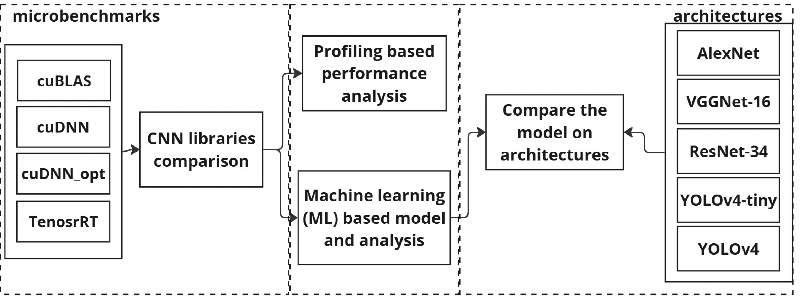

# Deep Learning Library Performance Characterization and Optimization for Edge-AI on Embedded GPUs

Micro-benchmarks for convolution layers of convolutional neural networks (CNNs) using DL libraries (cuBLAS, cuDNN, cuDNN opt, and TensorRT) for fair performance evaluation.

# Get Started
This code base supports simple usage of a micro-benchmark and a parser for it.

## Requirements
* Jetson TX2
* CUDA 10.2
* cuDNN 8
* TensorRT 8

## Microbenchmarking
