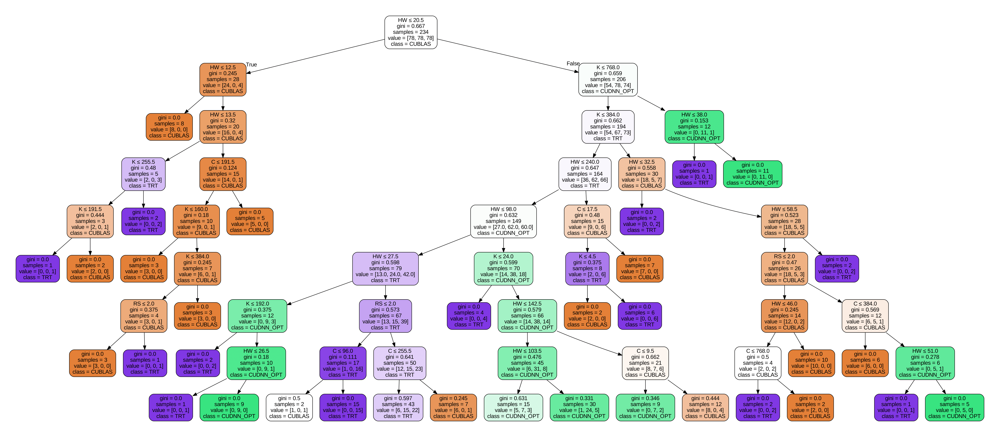

# Deep Learning Library Performance Characterization and Optimization for Edge-AI on Embedded GPUs

Micro-benchmarks for convolution layers of convolutional neural networks (CNNs) using DL libraries (cuBLAS, cuDNN, cuDNN opt, and TensorRT) for fair performance evaluation.


# Get Started
This code base supports simple usage of a micro-benchmark and a parser for it.

## Requirements
* Jetson TX2
* CUDA 10.2
* cuDNN 8
* TensorRT 8

## Project Structure
```bash
├── autotesting.sh       # Batch runner script to test all methods and metrics
├── tester.sh            # Core script that compiles and runs inference with the selected method
├── mbnet.h              # Header file with macro definitions for method dispatching
├── mbnet.cu             # Main CUDA benchmarking file for convolution inference
├── csv/                 # Output CSVs with runtime results
├── unroll_cublass/      # Output profile log data of cuBLAS method
├── tensorrt/            # Output profile log data of TensorRT method
├── cudnn/               # Output profile log data of cuDNN method
├── cudnn_opt/           # Output profile log data of cuDNN_opt method
├── trt_dependencies/    # Directory containing the dependency classes, methods, and definitions for the TensorRT method
├── config.py/           # Python file with configuration parameters and libraries to parse
├── parse.py/            # Python file parsing the log data into the CSV files
├── create_csv.py/       # Python file creating csv file for future parsing
└── README.md
```
## Microbenchmarking
To run all convolutional configurations across all methods and store results:
```
sudo ./autotesting
```
In the `autotesting.sh` script, you can specify which libraries to benchmark by modifying the `out_path` variable. Each entry corresponds to a specific backend:

- `unroll_cublass` → **cuBLAS**
- `cudnn` → **cuDNN**
- `cudnn_opt` → **cuDNN (tuned)**
- `tensorrt` → **TensorRT**
- `mbnet_method` → **mbNet**

You can also define which performance metrics to collect by editing the `metrics` list. Supported profiling metrics include:

- `None`
- `sm_efficiency`
- `achieved_occupancy`
- `warp_execution_efficiency`
- `inst_per_warp`
- `gld_efficiency`
- `gst_efficiency`
- `shared_efficiency`
- `shared_utilization`
- `l2_utilization`
- `global_hit_rate`
- `tex_cache_hit_rate`
- `tex_utilization`
- `ipc`
- `inst_issued`
- `inst_executed`
- `issue_slot_utilization`
- `dram_utilization`

You can enable or disable any combination of these metrics depending on your profiling objectives.

The `autotesting.sh` script calls `tester.sh`, which handles:

- Setting the main configuration parameters:
  - `C` (input channels)
  - `HW` (height/width of the input)
  - `K` (output channels)
  - `RS` (kernel size)
- Compiling and running the `mbnet.cu` file for the specified configuration and library.

Several predefined configurations are commented within `tester.sh`. You can:
- **Uncomment** specific lines to test predefined configurations.
- **Add new configurations** by defining new Bash lists for `C`, `HW`, `K`, and `RS`.

These parameters are then reflected in `mbnet.h`, where macro values are updated accordingly.

`tester.sh` accepts two arguments:
1. **Library** to profile (`cublas`, `cudnn`, `cudnn_opt`, or `tensorrt`)
2. **Performance metric** to collect

Based on the selected library, `tester.sh` sets the corresponding macro in `mbnet.h` to `1`. For example:
- If `tensorrt` is selected, `#define TRT 1` will be written in `mbnet.h`.

Finally, `mbnet.cu` is compiled and profiled using `nvprof`, collecting the specified performance metric for that configuration and backend.

The `mbnet.cu` file is the central CUDA source that executes convolution operations using different GPU libraries. It conditionally compiles and runs backend-specific implementations based on macro definitions set in `mbnet.h`.

Depending on which macro is enabled (e.g., `CUBLAS`, `CUDNN`, `CUDNN_OPT`, or `TRT`), the corresponding backend is invoked for the selected convolutional configuration.

In summary:

- **cuBLAS** → invokes `cublasSgemm`
- **cuDNN** → uses `cudnnConvolutionForward`
- **TensorRT** → builds and runs a TensorRT engine dynamically
- **MbNet** → chooses the backend automatically by setting the appropriate macro based on a decision model

This modular setup allows consistent benchmarking of the same configuration across all supported libraries under a unified interface.

## Parsing

After profiling a configuration, the runtime results are saved in a separate folder for each library. The output filenames follow this format: nvprof_comp_<C><HW><K>_<RS>.txt. For example, a profile of a configuration with C=64, HW=112, K=128, RS=3 will produce: nvprof_comp_64_112_128_3.txt

These files are stored in directories named after each library (e.g., `cublas/`, `cudnn/`, `tensorrt/`, etc.).

To aggregate results:

1. **Edit** `config.py`  
   Define the list of configurations you want to parse or filter.

2. **Run parsing scripts**  
   Execute the following scripts to generate CSV summaries of performance:

   ```bash
   python create_csv.py
   python parse.py

These scripts will:
* Read the raw profiler logs.
* Extract the specified performance metrics.
* Output consolidated CSV files for analysis or visualization.

After generating CSV files for each library, you can determine the fastest backend for every configuration. This data can be used to train a machine learning model that predicts the optimal library for a given convolutional setup.

In our research, we trained two **Decision Tree** models:

- **79-configuration Decision Tree**
- **150-configuration Decision Tree**




---

### Integration with `tester.sh`

Both tree implementations are embedded in the `tester.sh` script. You can activate either version by commenting/uncommenting the corresponding lines.

When `tester.sh` is called with the `mbnet` method, the script:

1. Uses a lookup table to predict the best-performing library for the given configuration.
2. Sets the appropriate macro flag in `mbnet.h` (e.g., `#define CUBLAS 1`).
3. Compiles and runs the `mbnet.cu` file using the predicted backend.

This ML-driven selection enables **dynamic backend switching** without manual tuning, providing high performance across diverse convolutional workloads.
